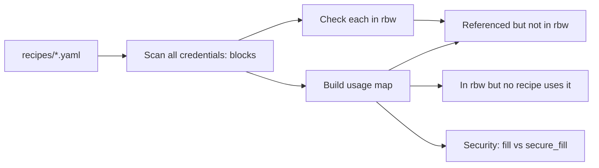

# credential-auditor Skill

**Full picture: what's referenced, what's missing, what's unused, what's insecure.**

---

## What it audits



---

## Step-by-step protocol

### 1. Scan all recipes

```bash
ls recipes/*.yaml
```

Skip `schema.yaml`. Load every other `.yaml` file. Parse as YAML.

From each recipe, extract:
- `credentials:` block — all namespace/store/item/fields entries
- Every `action: secure_fill` step's `credential:` reference
- Every `action: fill` step — flag any that fill into password/card fields

Build a flat list:
```
recipe_name → [{store, item, field, alias, ref_string}]
```

### 2. Check each credential against rbw

For each unique `(store=rbw, item, field)` tuple:
```bash
rbw get --field <field> "<item>"
```

Record:
- EXIT 0, non-empty output → EXISTS
- EXIT 0, empty output → EXISTS_EMPTY
- Non-zero exit → MISSING

If rbw is not installed or not unlocked, warn once and skip all rbw checks.

### 3. Check for unused rbw items

```bash
rbw list
```

For each item in rbw output, check if any recipe references it (substring match on item name). Items in rbw with no recipe referencing them → UNUSED.

Note: "unused" means no recipe references them, not that they're unimportant. Flag, don't delete.

### 4. Security check: fill vs secure_fill

For each `action: fill` step across all recipes, check if:
- `target.selector` contains: `password`, `card`, `cvv`, `ssn`, `pin`, `secret`, `token`, `key`
- `target.placeholder` contains any of the above
- Value pattern: numeric string >12 digits (possible card number)

If any match: flag as SECURITY WARN — "plaintext fill into what looks like a sensitive field."

### 5. Stale credential detection

rbw doesn't expose last-used timestamps directly, but check:
```bash
rbw get --full "<item>"
```

Look for `Updated:` or `Last Used:` lines in the output. If the item was last updated >90 days ago and is referenced in a recipe, flag as STALE_MAYBE (needs human review).

If rbw doesn't expose this info, skip silently (don't warn about missing timestamps).

---

## Report format

```
Credential Audit — 2026-03-26
Recipes scanned: 3  |  rbw items checked: 7
════════════════════════════════════════════════

USAGE MAP
  primary card
    ├─ pay-water-milwaukee  (card.number, card.cvv, card.exp_month, card.exp_year)
    └─ pay-electric         (card.number, card.cvv)
  electric account
    └─ pay-electric         (login.password)
  checking account
    └─ (no recipes)         → UNUSED

MISSING (referenced in recipe, not in rbw)
  ✗ "primary card" field:exp_year
      → pay-water-milwaukee credentials.card.fields.exp_year
      Fix: add exp_year field to "primary card" in Bitwarden

UNUSED (in rbw, no recipe references it)
  ~ "checking account"  — not referenced by any recipe
  ~ "old netflix login" — not referenced by any recipe

SECURITY
  ✓ No plaintext fill into sensitive-looking fields detected

STALE (>90 days since last update)
  ~ "electric account" — last updated 2025-10-12 (165 days ago)
    Review: is the password still current?

════════════════════════════════════════════════
VERDICT
  Errors:   1  (missing rbw field — recipe will fail at runtime)
  Warnings: 3  (2 unused items, 1 stale item)
  Security: OK
```

---

## After reporting

- Errors: "These will cause recipe failures. Fix before running."
- Security warns: "Consider changing `fill` to `secure_fill` with an rbw reference for these fields."
- Unused: "These rbw items aren't used by any recipe. Informational only — they may be used elsewhere."
- Offer: "Fix the missing field now?" → offer to either add the rbw field or update the recipe reference

---

## Examples

```
User: "audit my credentials"
Claude: [scans all recipes, checks rbw, produces full report]

User: "which recipes use my primary card?"
Claude: [focused answer from usage map — skips full audit]

User: "are there any credentials I'm not using?"
Claude: [focuses on UNUSED section only]

User: "check for insecure fill steps in my recipes"
Claude: [focuses on SECURITY section only]
```
