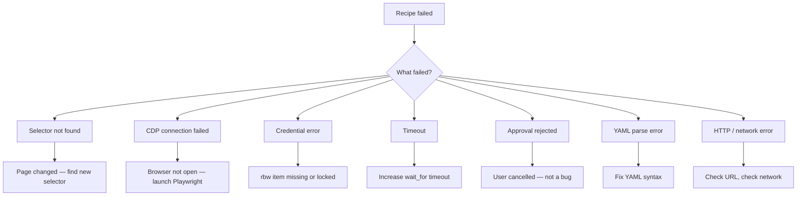

# recipe-debugger Skill

**Why did it fail? What do I change? Can we fix it now?**

---

## Failure pattern map



---

## Step-by-step protocol

### 1. Gather context

Ask (or check automatically):
- Recipe name / file path
- Which step failed (if known from error output)
- Error message or percept output from the failed run
- Whether this recipe worked before (regression vs. first run)

Read the recipe YAML:
```bash
cat recipes/<name>.yaml
```

### 2. Identify the failure pattern

Match the error to a pattern:

| Error signal | Pattern |
|---|---|
| `element not found` / `ERROR: element not found` | Selector not found |
| `Could not find CDP port` / `No pages found` | CDP not connected |
| `rbw fetch failed` / `not found or already expired` | Credential error |
| `asyncio.TimeoutError` / `wait timed out` | Timeout |
| `status: cancelled` + gate in percepts | Approval gate rejected |
| `yaml.scanner.ScannerError` | YAML parse error |
| `Connection refused` / `HTTP 4xx/5xx` | Network/HTTP error |
| `Handle not found or already expired` | Handle TTL expired |

### 3. Diagnose by pattern

#### Selector not found
Page structure changed. The CSS selector in the recipe no longer matches any element.

Diagnosis:
```
Step N used selector: '<css>'
This selector returned no elements — the page layout has changed.
```

Fix options:
1. Open the site in Playwright and take a snapshot: `browser_snapshot`
2. Find the new element for the same form field
3. Suggest updated selector: "The field is now `input[id='account-num']` instead of `input[name='account']`"
4. Offer to apply the fix and re-run

#### CDP connection failed
Browser isn't open or not exposed on a CDP port.

Diagnosis:
```
No Chromium process found with --remote-debugging-port.
The MCP server needs a browser to fill credentials into.
```

Fix: "Open a browser via Playwright first — run `browser_navigate` to any page, then retry."

#### Credential error
Either rbw is locked, or the item/field name is wrong.

Check:
```bash
rbw unlocked   # or: rbw sync
rbw get --field <field> "<item name>"
```

Diagnosis options:
- `rbw locked` → "Run `rbw unlock` and retry"
- `not found` → "Check the exact item name with `rbw list`. It may be stored as 'Primary Card' vs 'primary card' (case sensitive)"
- Empty field → "The field exists but has no value — update it in Bitwarden"

#### Timeout
The page was too slow or the expected text never appeared.

Identify the step's `wait_for` text. Check if:
- The text appears but is slightly different → update `wait_for`
- The site requires a login first → check earlier steps
- Page is genuinely slow → increase `actuator_config.timeout`

Suggest: "Change `wait_for: 'Payment Summary'` to `wait_for: 'Payment Review'` (the text changed)"
Or: "Add `actuator_config: { timeout: 60000 }` to the recipe header"

#### Approval gate rejected
User said no at the gate. This is correct behavior — not a bug.

Diagnosis: "You cancelled at the approval gate — the recipe stopped safely before submitting."
Action: "Nothing to fix. Run the recipe again when ready, and approve the gate."

#### YAML parse error
Recipe file has a syntax issue.

Show the line/column from the error. Common causes:
- Unindented step continuation
- Missing `:` after key
- Unquoted string containing `:` (e.g. `url: https://example.com` — needs quotes if value has `:`... actually fine, but `message: Pay: $50` needs quotes)

Suggest the fix inline.

#### Handle TTL expired
Recipe took too long and the 5-minute credential handle expired mid-run.

Diagnosis: "Credential handles expire after 5 minutes. The recipe paused too long (likely at a slow page or gate) and the handle expired."
Fix: "Re-run the recipe. If it consistently times out, check if a page is loading slowly — add `action: sleep` with `seconds: 2` before the failing secure_fill."

---

## 4. Suggest fix

Always present:
1. What failed (step N, action, error)
2. Why it failed (pattern match)
3. Exact fix (what to change in the YAML or environment)
4. Offer to apply the fix: "Want me to update the recipe with this fix?"

---

## 5. Offer re-run

After fix is applied or confirmed:
"Fix applied. Run it now? (`yes` to run / `dry run` to test without executing)"

---

## Report format

```
Recipe: pay-water-milwaukee
Failed at: Step 4 — secure_fill (card.number)
Error: rbw fetch failed for 'primary card': item not found

DIAGNOSIS: Credential error — rbw item not found
  The recipe references rbw item "primary card" but rbw can't find it.

CHECKS:
  rbw list shows: "Primary Visa", "primary card (archived)"
  → "primary card" may be archived or named differently

SUGGESTED FIX:
  Option A: Unarchive "primary card" in Bitwarden
  Option B: Update recipe credentials.card.item from "primary card" to "Primary Visa"

  Show diff:
  - item: "primary card"
  + item: "Primary Visa"

Apply fix B and re-run? (yes / no)
```

---

## Examples

```
User: "recipe failed"
Claude: "Which recipe? And do you have the error message?"

User: "pay-water failed — selector not found on step 3"
Claude: [reads recipe, identifies selector, checks page structure, suggests new selector]

User: "why does my electric bill recipe keep timing out?"
Claude: [finds timeout pattern, suggests wait_for text fix or timeout increase]
```
