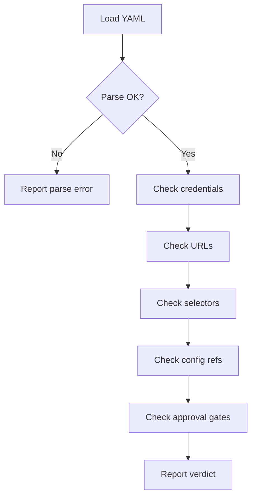

# route-validator Skill

**Pre-flight check for a recipe. Catch problems before the browser opens.**

```
Usage: /route-validator recipes/pay-water.yaml
       /route-validator pay-water-milwaukee
```

---

## What it checks



---

## Step-by-step protocol

### 1. Load the recipe

```bash
cat recipes/<name>.yaml
```

If not found, try appending `.yaml` to the argument. If still missing: `FAIL — file not found`.

Parse as YAML. If malformed: `FAIL — YAML parse error at line N`.

### 2. Check credentials (rbw)

For each entry in `credentials:`:
```bash
rbw get --field <field> "<item>"
```

Run for every `fields:` mapping. Check:
- Exit code 0 AND output is non-empty → PASS
- `rbw` not found → WARN (rbw not installed, skip credential checks)
- Non-zero exit or empty → FAIL with item + field name

### 3. Check URLs

For each `action: navigate` step, extract `url:`. Run a HEAD request:
```bash
curl -sI --max-time 10 --location "<url>" | head -1
```

- HTTP 200/301/302 → PASS
- HTTP 4xx/5xx → WARN (site may require login, flag it)
- Connection refused / timeout → FAIL

### 4. Check CSS selectors (syntax only)

For each step with `target: { selector: "..." }`, validate CSS syntax. A selector is valid if it doesn't contain:
- Unmatched brackets `[`, `(`
- Empty parts `::`, `  ` (double space)
- Invalid pseudo-classes (anything after `:` that isn't a known pseudo)

This is syntax-only — element existence can't be checked without running the recipe.

### 5. Check config variable references

Scan all step values for `${config.<key>}` patterns. For each:
- Check that `<key>` exists in the `config:` block → PASS
- Missing → FAIL listing which step references it

### 6. Check approval gates before irreversible actions

Scan steps for any with `action: click` where `target.text` contains (case-insensitive):
`pay`, `submit`, `confirm`, `purchase`, `place order`, `make payment`, `send`, `transfer`

For each such step, check that an `action: await_approval` step appears **before** it in the steps list.
- Gate present → PASS
- Gate missing → FAIL "Step N clicks 'Pay' with no prior approval gate"

---

## Report format

```
Recipe: pay-water-milwaukee.yaml
────────────────────────────────────────────────────
CREDENTIALS
  ✓ card.number       rbw:"primary card" field:number
  ✓ card.cvv          rbw:"primary card" field:cvv
  ✗ card.exp_year     rbw:"primary card" field:exp_year — not found

URLS
  ✓ https://www.milwaukeewaterworks.com/  → 200 OK
  ~ https://app.milwaukeewaterworks.com/  → 302 redirect (login required — expected)

CSS SELECTORS
  ✓ input[name="account"] — valid syntax
  ✓ input[type="password"] — valid syntax

CONFIG REFS
  ✓ ${config.account_number} — defined
  ✓ ${config.email} — defined

APPROVAL GATES
  ✓ Step 7: await_approval before "Pay Bill" click

────────────────────────────────────────────────────
VERDICT: FAIL (1 error, 1 warning)
  ERROR:   card.exp_year not found in rbw — add to "primary card" or correct field name
  WARN:    URL returns 302 — session auth required, expected for payment sites
```

---

## After reporting

- If PASS: "Recipe looks good. Run it with: `pay water bill`"
- If FAIL: Show specific fixes, offer to open the recipe for editing
- Never attempt to run the recipe if validation fails

---

## Examples

```
User: "/route-validator pay-water-milwaukee"
Claude: [runs checks, reports as above]

User: "validate my electric bill recipe before I run it"
Claude: [finds pay-electric.yaml, runs all checks]

User: "check if my recipe credentials are still valid"
Claude: [focuses on credential checks, skips URL/selector checks if user just wants creds]
```
