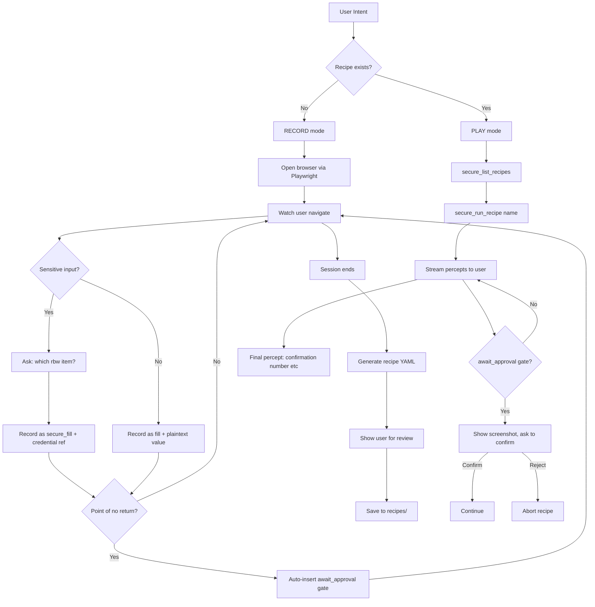
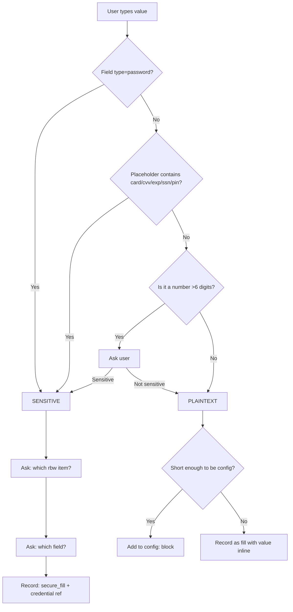
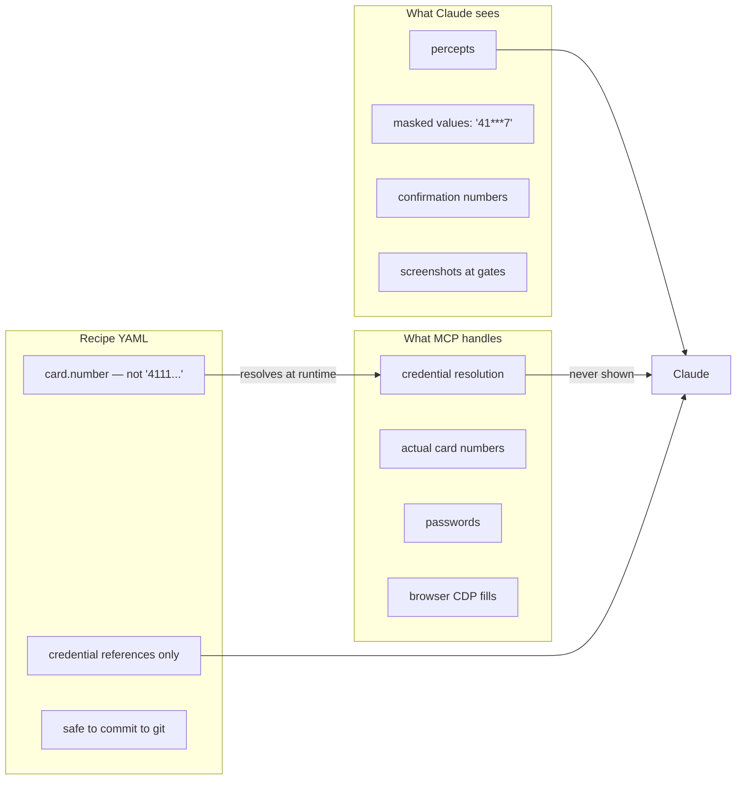

# secrets-router Skill

**Human teaches. Agent repeats. Credentials never leave the MCP.**

```
First time:  User performs task → Claude records steps → Recipe YAML generated
After that:  "pay my water bill" → secure_run_recipe("pay-water-bill") → done
```

---

## Architecture



---

## Modes

| Mode | When to use | Trigger phrases |
|------|-------------|-----------------|
| **record** | First time automating a task | "record me paying...", "teach you to...", "automate this" |
| **play** | Run an existing recipe | "pay my water bill", "run recipe X", task name matches a recipe |
| **list** | See what's automated | "what can you automate?", "list recipes" |
| **edit** | Modify a recipe | "change the card for water bill", "update my recipe" |

---

## RECORD Mode

### When to activate

User says any of:
- "record me paying my water bill"
- "teach you to automate this"
- "I want to automate [task] — let me show you"
- "start recording"

Or: user mentions a task involving a website + credentials and no recipe exists for it.

### Step-by-step protocol

```
1. Confirm: "I'll record this so you only have to do it once.
             Open the site when ready and I'll watch."

2. Open browser via Playwright MCP (mcp__playwright__browser_navigate)

3. For each user action, record a step entry:
   {
     step_num: N,
     action: <verb>,
     target: <selector or text>,
     value: <plaintext or credential ref>,
     percept: <what the agent will see>,
     is_sensitive: false,
     is_irreversible: false
   }

4. SENSITIVE VALUE DETECTION:
   Trigger when user types into:
   - password fields (type="password")
   - card number fields (placeholder contains "card", "number", "CVV", "CVC", "exp")
   - SSN / account number fields
   - security question answers

   When detected:
   → STOP. Ask: "Is this a sensitive value I shouldn't store in plaintext?"
   → If yes: "Which rbw item holds this? (e.g. 'primary card', 'water account')"
   → "Which field? (e.g. number, cvv, password)"
   → Record as: action: secure_fill, credential: <item>.<field>
   → The actual value is NEVER recorded.

5. IRREVERSIBLE ACTION DETECTION:
   Auto-insert await_approval BEFORE any button/link with text:
   - "Submit", "Pay", "Confirm", "Purchase", "Place Order", "Make Payment"
   - "Send", "Transfer", "Delete", "Remove"
   → Insert step: action: await_approval
   → Include a screenshot step just before it

6. EXTRACT DETECTION:
   After navigation to a results/summary page:
   → Offer: "Should I capture any values from this page? (balance, confirmation number, etc.)"
   → If yes: record extract step with return_to_claude: true

7. SESSION END:
   When user says "done", "that's it", "stop recording", or closes the tab.
   → Generate recipe YAML (see template below)
   → Show it to user: "Here's the recipe I recorded. Look right?"
   → Ask: "What should I call this recipe?" (suggest kebab-case from task name)
   → Save to: recipes/<name>.yaml
```

### Recipe YAML template (generated output)

```yaml
name: <kebab-case-name>
description: <What this recipe does — one sentence>
version: "1.0"

credentials:
  <alias>:                    # e.g. card, bank, login
    store: rbw
    item: "<rbw item name>"   # exactly what user said
    fields:
      <logical>: <rbw_field>  # e.g. number: number, cvv: cvv

actuator: playwright

config:
  # Non-sensitive values that appear in the recipe
  # e.g. account_number, email, phone
  <key>: "<value>"

steps:
  - action: navigate
    url: <url>
    wait_for: "<text that appears when page loads>"
    percept: "Loaded <site name>"

  # fill steps (plaintext — agent can see these)
  - action: fill
    target: { selector: '<css selector>' }
    value: "${config.<key>}"
    percept: "Entered <label>"

  # secure_fill steps (credentials — agent sees only masked)
  - action: secure_fill
    target: { selector: '<css selector>' }
    credential: <alias>.<field>
    percept: "filled: <label> [MASKED]"

  # before any irreversible action:
  - action: screenshot
    label: "pre-submit"
    percept: "Screenshot before submission"

  - action: extract
    targets:
      total: { selector: '<selector>' }
    return_to_claude: true
    percept: "Total: ${total}"

  - action: await_approval
    message: "Confirm <action> of ${total}?"

  - action: click
    target: { text: "<Submit button text>" }
    wait_for: "<confirmation text>"
    percept: "Submitted"

  - action: extract
    targets:
      confirmation: { selector: '<selector>' }
    return_to_claude: true
    percept: "Confirmation: ${confirmation}"
```

### Sensitive value decision tree



---

## PLAY Mode

### When to activate

- User mentions a task that matches an existing recipe name (fuzzy match)
- User says "run recipe X" or "execute X"
- secure_list_recipes() shows a match

### Protocol

```
1. Call secure_list_recipes() to verify recipe exists
   → If no match: go to "Recipe not found" response (below)

2. Confirm with user (optional for known recipes, required first time):
   "I have a recipe for that. Want me to run it?"
   → Skip confirmation if user phrasing is unambiguous (e.g. "pay my water bill now")

3. Call secure_run_recipe("<name>")

4. For each percept received:
   → Show it to user as it streams in
   → Format: step N/total: <percept>

5. At await_approval gates:
   → Display the screenshot
   → Show the approval message
   → Ask: "Confirm? (yes/no)"
   → If yes: send approval signal to resume
   → If no: "Aborting. The recipe has been stopped before submission."

6. At completion:
   → Show final percepts (confirmation number, totals, etc.)
   → Offer: "Want me to save the confirmation number somewhere?"
```

### Recipe not found response

```
"I don't have a recipe for that yet. Want me to record one so you only have to do it once?

Say 'record [task name]' and walk me through it.
I'll watch, record each step, and generate a recipe you can run anytime."
```

---

## LIST Mode

### When to activate

- "what can you automate?"
- "list my recipes"
- "what recipes do you have?"

### Protocol

```
1. Call secure_list_recipes()
2. Format output as table:

   | Recipe | Description | Last run |
   |--------|-------------|----------|
   | pay-water-milwaukee | Pay Milwaukee Water Works bill via credit card | — |
   | ... | ... | ... |

3. Offer: "Say the task name to run one, or 'record [new task]' to add one."
```

---

## EDIT Mode

### When to activate

- "change the card in my water bill recipe"
- "update the selector for [site]"
- "add an approval gate to [recipe]"
- "my account number changed for [recipe]"

### Protocol

```
1. Identify recipe by name (fuzzy match or ask)
2. Read existing recipe YAML
3. Show current values for the relevant section
4. Apply change:
   a. credential reference change: update alias.field reference
   b. config value change: update config block
   c. selector change: update target.selector
   d. add approval gate: insert await_approval + screenshot before specified step
   e. remove step: delete from steps list

5. Show diff of changes
6. Ask: "Save these changes?"
7. Write updated YAML
```

---

## Interaction Examples

### Example 1: First time (RECORD)

```
User: "I need to automate paying my electric bill"

Claude: "I'll record this so you only have to do it once.
         Open your electric company's payment page when ready — I'll watch and record each step."

[User navigates to site]

Claude: [observing via Playwright snapshot]
        "Step 1 recorded: navigate → https://myelectric.com (wait for 'Account Login')"

[User types account number]
Claude: "Is this account number sensitive? (yes/no)"
User: "no, it's on my bill"
Claude: "Got it — recording as plaintext config value."

[User types password]
Claude: [field type=password detected — auto-prompt]
        "That's a password field — I won't store the actual value.
         Which rbw item holds this login? (e.g. 'electric account')"
User: "electric account"
Claude: "And which field in that item? (password? or the default?)"
User: "password"
Claude: "Recorded as secure_fill: login.password"

[User clicks Pay $84.00 button]
Claude: [detects Submit-class button]
        "This looks like a payment submission — auto-inserting screenshot + approval gate before it."

[User: "that's it, done"]
Claude: "Session complete. Here's the recipe I recorded:

---
name: pay-electric
description: Pay monthly electric bill
credentials:
  login:
    store: rbw
    item: electric account
    fields:
      password: password
config:
  account_number: "7291038201"
steps:
  - action: navigate
    url: https://myelectric.com
    wait_for: Account Login
  - action: fill
    target: { selector: 'input[name="account"]' }
    value: "${config.account_number}"
  - action: secure_fill
    target: { selector: 'input[type="password"]' }
    credential: login.password
  - action: click
    target: { text: 'Pay Bill' }
    wait_for: Payment Summary
  - action: screenshot
    label: pre-submit
  - action: extract
    targets:
      total: { selector: '.payment-total' }
    return_to_claude: true
  - action: await_approval
    message: Confirm payment of ${total}?
  - action: click
    target: { text: 'Pay $84.00' }
    wait_for: Thank you
  - action: extract
    targets:
      confirmation: { selector: '.confirmation-number' }
    return_to_claude: true
---

Look right? I'll save it as 'pay-electric'. Next time just say 'pay my electric bill'."
```

### Example 2: Second time (PLAY)

```
User: "pay my electric bill"

Claude: "Running recipe 'pay-electric'..."

  Step 1/9: Loaded electric bill payment portal
  Step 2/9: Entered account number
  Step 3/9: filled: Password [MASKED]
  Step 4/9: Payment summary loaded
  Step 5/9: Screenshot of payment review page
  Step 6/9: Total: $84.00

  [Screenshot displayed]

  "Confirm payment of $84.00? (yes/no)"

User: "yes"

  Step 7/9: Payment submitted
  Step 8/9: Confirmation: #EL-2026-884921 | $84.00 | 2026-03-26

  "Done. Confirmation #EL-2026-884921 for $84.00."
```

### Example 3: LIST

```
User: "what can you automate for me?"

Claude: "Here are your saved recipes:

  | Recipe               | Description                                |
  |----------------------|--------------------------------------------|
  | pay-water-milwaukee  | Pay Milwaukee Water Works bill via credit card |
  | pay-electric         | Pay monthly electric bill                  |

  Say the task name to run one, or 'record [new task]' to add another."
```

### Example 4: EDIT — change credential reference

```
User: "my water bill is now on a different card — update the recipe"

Claude: "The water bill recipe uses 'primary card' from rbw for all card fields.
         What rbw item should it use now?"
User: "backup card"
Claude: "Updated. Here's the change:

  - item: 'primary card'    →    item: 'backup card'

  (All fields: number, name, exp_month, exp_year, cvv)

  Save?"
User: "yes"
Claude: "Saved. Next run will use backup card."
```

---

## Security Principles



1. **Recipe YAML is safe to commit** — it contains only `card.number`, never `4111111111111111`
2. **Agent sees only percepts** — masked strings, screenshots, confirmation text
3. **Values exist in-process only** — zeroed after each secure_fill completes
4. **Approval gates are non-negotiable** — auto-inserted before every irreversible action
5. **Handles are single-use, 5-minute TTL** — no replay attacks

---

## Credential Reference Format

```
<alias>.<field>

Examples:
  card.number       → rbw get --field number "primary card"
  card.cvv          → rbw get --field cvv "primary card"
  login.password    → rbw get --field password "electric account"
  bank.routing      → rbw get --field routing "checking account"
```

Aliases are defined in the recipe's `credentials:` block and are scoped to that recipe.

---

## Action Primitives Quick Reference

| Action | Claude sees | MCP does |
|--------|-------------|---------|
| `navigate` | "Loaded [site]" | browser_navigate |
| `click` | "Clicked [text]" | browser_click |
| `fill` | "Entered [label] = [value]" | browser_fill_form |
| `secure_fill` | "filled: [label] [MASKED ****1017]" | resolve credential → browser CDP fill |
| `extract` | `{ key: "value", ... }` | browser_snapshot → parse |
| `screenshot` | image | browser_take_screenshot |
| `await_approval` | "Confirm [message]?" | pause, wait for signal |
| `select` | "Selected [option]" | browser_select_option |
| `check` | "Checked [label]" | browser_click checkbox |
| `assert` | pass/fail | browser_snapshot → check |

---

## File Locations

```
recipes/                   ← in secrets-router repo
├── pay-water-milwaukee.yaml
├── pay-electric.yaml
└── schema.yaml            ← full action reference

MCP server: server.py
Tools: secure_list_recipes(), secure_run_recipe(name, dry_run?)
```

---

## Failure Handling

| Failure | Response |
|---------|----------|
| Recipe name not found | Offer to record it |
| Selector not found on page | Report which step failed, suggest edit mode to update selector |
| rbw item not found | "rbw can't find '[item name]' — is it stored under a different name? `rbw list` to check." |
| User rejects approval gate | Abort cleanly, report "Stopped before submission" |
| Network error mid-recipe | Report last successful step, offer to retry from that step |
| Site layout changed | Report failed selector, suggest re-recording the affected steps |

---

## Progressive Trust Model

```
Run 1 (recorded):   fully supervised — user performs every action
Run 2+:             autonomous — agent performs, pauses only at approval gates
Config override:    secure_run_recipe("pay-water", config_overrides={"amount": "50.00"})
Dry run:            secure_run_recipe("pay-water", dry_run=True) — logs steps, no execution
```

Trust grows automatically. The recipe is the proof of prior human approval.
Approval gates are the permanent human-in-the-loop, regardless of how many times a recipe has run.
