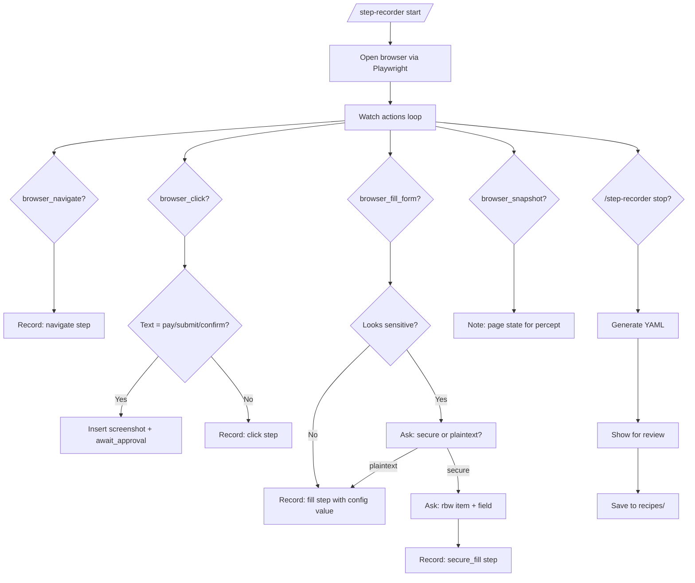

# step-recorder Skill

**You drive. I write the recipe.**

```
/step-recorder start "pay electric bill"
[you do the thing]
/step-recorder stop
→ recipe YAML generated and saved
```

---

## Architecture



---

## Modes

| Command | Action |
|---|---|
| `/step-recorder start "task name"` | Begin recording session |
| `/step-recorder stop` | End session, generate YAML |
| `/step-recorder status` | Show steps recorded so far |
| `/step-recorder discard` | Abandon session without saving |

---

## START protocol

1. Acknowledge: "Recording started for: [task name]. Navigate to the site and do the task normally — I'll watch and record each step."
2. Initialize step buffer: `[]`
3. Take a `browser_snapshot` to establish baseline DOM state
4. Enter watching loop

---

## WATCHING loop

After each user action, observe via `browser_snapshot` and infer the step:

### browser_navigate
```yaml
- action: navigate
  url: <url from action>
  wait_for: "<first unique text visible after load>"
  percept: "Loaded <domain>"
```

### browser_click
Check `target.text` (if available) against irreversible keywords:
`pay`, `submit`, `confirm`, `purchase`, `place order`, `make payment`, `send`, `transfer`, `delete`

If match: auto-insert **before** the click:
```yaml
- action: screenshot
  label: "pre-submit"
  percept: "Screenshot before submission"
- action: await_approval
  message: "Confirm [action]?"
```
Then record the click:
```yaml
- action: click
  target: { text: "<button text>" }
  wait_for: "<text visible after click>"
  percept: "Clicked <button text>"
```

If no irreversible match, just record the click step.

### browser_fill_form
For each field in the form:

**Sensitive detection** — auto-flag if field selector or placeholder contains:
`password`, `card`, `cvv`, `cvc`, `exp`, `ssn`, `pin`, `secret`, `token`, `routing`, `account number`

Or if value pattern is: 13-19 consecutive digits (card number), 3-4 digits after known card number (CVV), or the field type is `password`.

**If sensitive detected:**
```
"That looks like a sensitive value ([field label]).
Should I store it securely via rbw, or as plaintext?
  secure — I'll reference it as a credential (never stored in recipe)
  plaintext — I'll put the value in the config block"
```

If **secure**:
```
"Which rbw item holds this? (e.g. 'primary card')"
"Which field? (e.g. number, cvv, password)"
```
→ Record:
```yaml
- action: secure_fill
  target: { selector: '<selector>' }
  credential: <alias>.<field>
  percept: "filled: <label> [MASKED]"
```
Add to `credentials:` block: `<alias>: { store: rbw, item: "<item>", fields: { <field>: <rbw_field> } }`

If **plaintext**:
→ Add to `config:` block, record:
```yaml
- action: fill
  target: { selector: '<selector>' }
  value: "${config.<key>}"
  percept: "Entered <label>"
```

### After a results/summary page loads
Offer: "Should I capture anything from this page? (confirmation number, balance, total?)"
- If yes: `browser_snapshot` to find selector, record `extract` step with `return_to_claude: true`

---

## STOP protocol

When user says `/step-recorder stop`, `"done"`, `"that's it"`, or closes the active tab:

1. Ask: "What should I call this recipe?" (suggest kebab-case from task name)
2. Ask: "Assign a credential alias for each secure item?" (only if not already named)
3. Generate complete YAML from step buffer
4. Show for review:
   ```
   Here's the recipe I recorded:

   [YAML block]

   Look right? (yes to save / edit to modify / discard to abandon)
   ```
5. On yes: save to `recipes/<name>.yaml`
6. Confirm: "Saved. Next time just say '[task name]'."

---

## Credential alias naming

When a user first references an rbw item, suggest an alias:
- `"primary card"` → alias: `card`
- `"electric account"` → alias: `login`
- `"checking account"` → alias: `bank`

Use short, semantic names. Ask if the alias isn't obvious.

---

## Generated YAML template

Follows the standard recipe schema exactly — same structure as `secrets-router` skill records. Config keys are derived from field labels, converted to `snake_case`.

---

## Examples

```
User: "/step-recorder start 'pay water bill'"
Claude: "Recording started. Go ahead and pay the water bill — I'll watch."

[user navigates to site]
Claude: "Step 1: navigate → https://milwaukeewaterworks.com ✓"

[user types account number]
Claude: "Is the account number sensitive? (no — it's on your bill) Recording as config.account_number."

[user types into password field — auto-detected]
Claude: "Password field detected. Secure or plaintext?"
User: "secure"
Claude: "rbw item name?"
User: "water account"
Claude: "Field? (password/username)"
User: "password"
Claude: "Recorded: secure_fill login.password ✓"

[user clicks 'Pay $42.80']
Claude: "Payment button detected — auto-inserting screenshot + approval gate before this click."

User: "/step-recorder stop"
Claude: "3 steps recorded. What should I call this recipe?"
User: "pay-water-milwaukee"
Claude: [shows YAML] "Look right?"
User: "yes"
Claude: "Saved. Next time say 'pay my water bill' and I'll run it."
```
